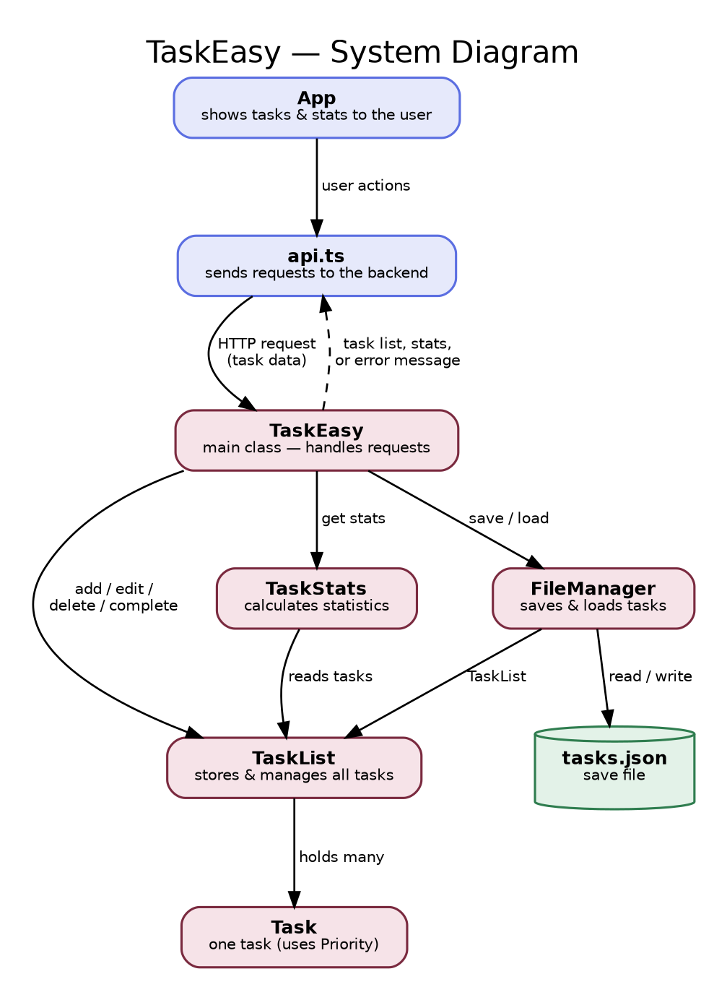

# TaskEasy

Task manager for CS2114 Project 1, group 92. A Java Spring Boot backend stores tasks in `backend/tasks.json` and a Vite/React/TypeScript frontend displays them.

## System diagram



## Running

Backend (port 8080):

```
cd backend
./mvnw spring-boot:run
```

Frontend (port 5173):

```
cd frontend
npm install
npm run dev
```

Open http://localhost:5173. The Vite dev server forwards `/api/...` to `http://localhost:8080/...`, so the backend does not need CORS.

Maven is downloaded automatically by `./mvnw` the first time. Java 17 or newer is required.

## Docker

```
docker compose up -d --build
```

Both containers join the private `taskeasy` network. Only the frontend publishes a port, so the backend is reachable only from inside that network. The backend image compiles the jar with Maven and runs it with Java 17, keeping the save file in the `taskeasy-data` volume at `/data/tasks.json`. The frontend image builds the React app and serves the static files with nginx.

The published port defaults to `127.0.0.1:8090`. To reach it from a reverse proxy on another machine, set the address in a `.env` file next to `docker-compose.yml`, for example the server's WireGuard address:

```
BIND_IP=10.8.0.2
FRONTEND_PORT=8090
```

Routing is handled by the reverse proxy in front of the stack. It serves the site from the frontend port and forwards `/api/...` to the backend with the `/api` prefix removed.

## Tests

```
cd backend
./mvnw test
```

This runs the unit tests for `Task`, `TaskList`, `TaskStats`, and `FileManager`, plus `TaskEasyTest`, which calls every endpoint through Spring's MockMvc.

## Layout

```
backend/src/main/java/taskeasy/   Task, Priority, TaskException, TaskList, TaskStats, FileManager, TaskEasy
backend/src/test/java/taskeasy/   unit tests for each class
frontend/src/                     api.ts, App.tsx, components
```

## REST API

All endpoints are served by `TaskEasy` on port 8080. Tasks are addressed by their zero-based position in the list.

| Method | Path | Body | Success | Failure |
|---|---|---|---|---|
| GET | `/tasks` | none | 200, array of tasks | |
| POST | `/tasks` | task input | 201, the created task | 400 |
| PUT | `/tasks/{index}` | task input | 200, the updated task | 400 |
| DELETE | `/tasks/{index}` | none | 200, empty body | 400 |
| PATCH | `/tasks/{index}/complete` | none | 200, the completed task | 400 |
| GET | `/stats` | none | 200, statistics | |

Task input (request body for POST and PUT):

```json
{ "name": "Lab", "description": "Write code", "deadline": "2026-09-25", "priority": "LOW" }
```

Task (response, and each element of the save file):

```json
{ "name": "Lab", "description": "Write code", "deadline": "2026-09-25", "priority": "LOW", "completed": false }
```

Statistics:

```json
{ "completed": 2, "overdue": 1, "completionRate": 0.5 }
```

Every 400 response has this shape, and the frontend shows the message to the user:

```json
{ "message": "Task name cannot be empty." }
```

Rules: `name` is 1 to 50 characters and unique, `description` is 1 to 200 characters, `deadline` is `yyyy-MM-dd`, `priority` is `LOW`, `MEDIUM`, or `HIGH`. A bad index, a duplicate name, an unparsable date or priority, or a save failure all return 400 and leave the list unchanged.

## Save file

`backend/tasks.json` is a JSON array of tasks in list order. It is written after every successful change and loaded on startup. If it does not exist the backend starts with an empty list.
